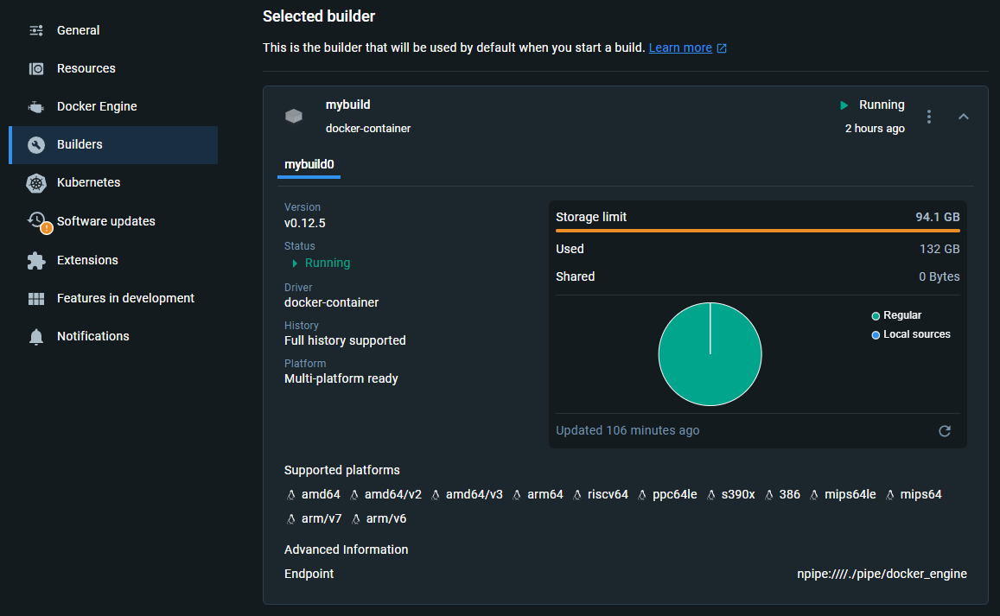

# Docker Container for Qt Building Environment

BuilderQt is a Docker container for building Qt source code for both amd64 and arm64. It will produce a compliled Qt binary and library tar file. In application deployment, extract the tar file to the target system and set the environment variable `QT_DIR` and `PATH` to the extracted folder.


## To Use

- Build Qt using `BuilderQt.sh` script.
  
	It will produce an output to the `build-$version` folder.

	> Help Command
	```bash
	./BuilderQt.sh --help
	```
	```bash
	Usage: BuilderQt.sh [OPTIONS]
	Options:
        -h, --help                Show this help message and exit

		-v, --version             No version specified, list all available versions

        -v, --version <VERSION>   Specify the version of Qt to build

		-b, --build <BUILD_TYPE>  Build the Qt Builder image

		-p, --push <BUILD_TYPE>   Push the Qt Builder image to the registry
                                  
	```

	> Example of building Qt 6.6.3
	```bash
	./BuilderQt.sh -v 6.6.3 -b
	```


## Requirement

It require docker buildx setup with using docker-container driver.

[Official Guide on Docker Buildx](https://docs.docker.com/reference/cli/docker/buildx/create/#driver)




## Folders Created on the build

| Folder | Description |
| ------ | ----------- |
| `build` | Contains compiled Qt library. |
| `src` | Contains downloaded Qt source code. |
| `cache` | Contains docker builderx cache. |


## Cautions

Building Qt is resource intensive. It is recommended to have at least **32GB of RAM** and **20 logical CPU cores** for building Qt.
